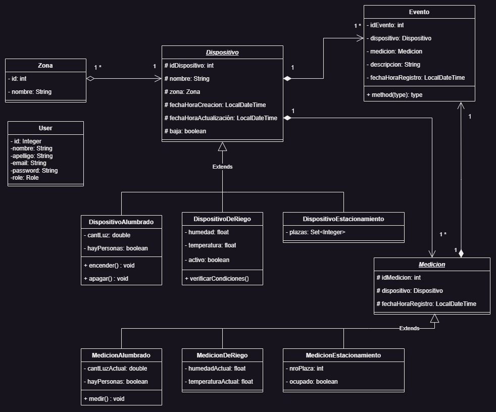

# Grupo-19-OO2-2023
<div align="center">
    
    
    
    
    
</div>

## Descripción
El proyecto tiene como objetivo desarrollar diferentes soluciones de Internet de las Cosas (IoT) con la idea de crear una [Smart City](https://panelesach.com/blog/smart-cities-o-ciudades-inteligentes-que-son/) o Ciudad Inteligente dentro de nuestra universidad [UNLa](http://www.unla.edu.ar/).

El objetivo principal de nuestro proyecto es aprovechar el potencial de IoT y las tecnologías de la información para mejorar la eficiencia, la calidad de vida y la sostenibilidad de nuestra universidad.

Nuestras soluciones permitirán recolectar datos del mundo real a través de sensores y dispositivos inteligentes, para luego utilizar esos datos y ejecutar acciones automáticas que tengan un impacto positivo en la vida de las personas y en el medio ambiente.

Queremos promover el uso inteligente de los recursos y compartir la información recopilada con la universidad y su comunidad, de manera que puedan beneficiarse de esa información y participar activamente en la construcción de una universidad más inteligente y sostenible en cuanto a instalaciones se refiere.

## :receipt: Soluciones IoT de cada integrante
- :droplet: `Riego` [Andres Cupo](https://github.com/Suhiang98)
- :car: `Estacionamiento` [Pablo Galvan](https://github.com/GalvanPablo)
- :bulb: `Alumbrado exterior` [Sebastián Marioni ](https://github.com/sebastianmarioni)


## :wrench: Tecnologias usadas


## :spiral_notepad: Diagrama de clases


## :white_check_mark: Como levantar el proyecto
### :arrow_down: Descargar el proyecto
Clone el proyecto mediante git
```bash
git clone https://github.com/GalvanPablo/Grupo-19-OO2-2023.git
```
### :package: Backend
1. Asegúrate de tener [Java JDK](https://www.oracle.com/java/technologies/javase/jdk19-archive-downloads.html) (Java Development Kit) instalado en tu computadora.
2. Instala un IDE (Entorno de Desarrollo Integrado) para Java, recomendamos usar [Spring Tools](https://spring.io/tools) en su version para Eclipse
3. Instala [Maven](https://maven.apache.org/download.cgi) la herramienta de gestión de proyecto
4. Instale [Lombok](https://projectlombok.org/setup/eclipse) tanto en su PC como en el IDE.
5. Asegurese de tener [MySQL](https://dev.mysql.com/downloads/workbench/) instalado
6. Abra el IDE e importe el proyecto existente de Maven. Busque la carpeta `\backend` dentro del proyecto.
7. Antes de prosegir deberá de crear la base de datos bajo el nombre `grupo-19-oo2`.
8. Por ultimo, con el proyecto ya abierto, acceda al archivo `\src\main\resources\application.yml` y edite la configuración de la base de datos - `url`, `username` y `password`
9. Una vez realizado todos los pasos anteriores debera de ser capaz de ejecutar el proyecto, para ello deberá de dirigirse al panel de Boot Dashboard (abajo a la izquierda por default) y desde allí podrá ser capaz ejecturarlo.

### :desktop_computer: Frontend
1. Asegúrate de tener [Node.js](https://nodejs.org/en) instalado en tu computadora. Recomendamos la version LTS (Long Time Support) para mejor compatibilidad.
2. Abrá su terminal o línea de comandos y vayá hacia la ruta `\frontend` del proyecto
```bash
cd ruta-del-frontend
```
3. Una vez en la carpeta del proyecto se deberan de instalar las dependencias del proyecto. Ejecute el siguiente comando:
```bash
npm install
```
4. Una vez que haya finalizado la instalación, ya puede ejecutar el siguiente comando para lanzar el proyecto:
```bash
npm start
```
Si desea poder visualizar el código le recomendamos que instale [Visual Studio Code](https://code.visualstudio.com/) y abrá con el la carpeta `\frontend`
